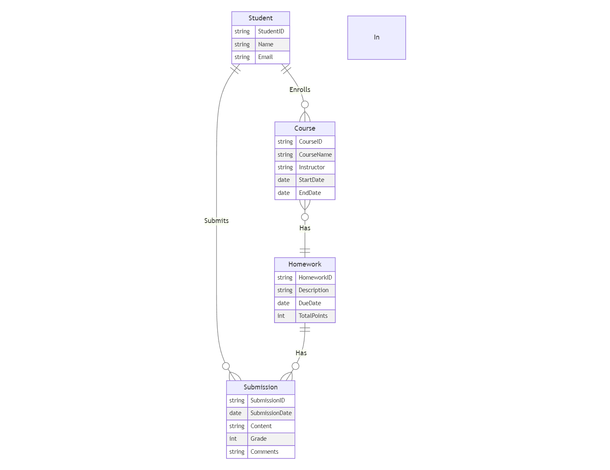

# R1.b - Entities and Relationships - Alan Liu

An example of a small scale-project that utilizes entities and relationships is a homework tracker for a teacher to use. Existing learning managemen systems such as Canvas could probably already be using this kind of system in the backend. Elements include the student, course, homework, and submission information. 

